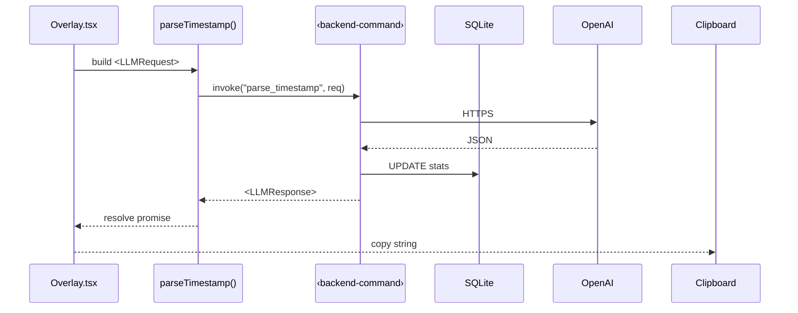

Below is a concise “integration playbook” that you can hand to ChatGPT‑Code (or any coding LLM) when you’re ready to wire the React guest UI to the Tauri (Rust) core.  I keep filenames, command names, and payloads intentionally generic so the instructions won’t break if you rename things during implementation.

---

## 0.  Shared language

| Concept                             | Generic handle to use in prompts                          |
| ----------------------------------- | --------------------------------------------------------- |
| Rust → JS **command**               | `<backend-command>`                                       |
| JS → Rust **event**                 | `<frontend-event>`                                        |
| Common **request/response payload** | `<LLMRequest>`, `<LLMResponse>`                           |
| Settings key‑value                  | `"hotkey"`, `"tz"`, `"stats"` (or whatever you settle on) |

When you prompt the coding LLM, always refer to these placeholders rather than hard‑coded filenames.  Then do a global replace (or let GPT suggest filenames after it sees your repo).

---

## 1.  File / folder outline

```
project-root/
├─ src-tauri/                # Rust side
│  ├─ commands.rs            # ‹backend‑command› declarations
│  ├─ updater.rs             # updater + tray glue
│  └─ db/                    # SQLite migrations if any
└─ src/                      # React + Vite guest
   ├─ api/tauri.ts           # thin promise wrappers for ‹backend‑command›
   ├─ components/
   │   ├─ Overlay.tsx        # top‑level popup
   │   └─ Selector.tsx       # up/down list
   ├─ hooks/useSettings.ts   # read/write KV store
   ├─ hooks/useLLM.ts        # call OpenAI & fallback
   └─ index.tsx
```

*These names are suggestions—swap at will.*

---

## 2.  Data contract (define once, generate twice)

### TypeScript

```ts
// src/types.ts
export interface LLMRequest {
  prompt: string;        // user text (edited clipboard)
  timezone: string;      // IANA TZ ("America/Chicago")
  formatStats: Record<string, number>; // {"d":14,"t":3...}
}

export interface LLMResponse {
  epoch: number;               // 1656789012
  suggestedIndex: number;      // 0..6 for the 7 formats
  certainty: "low" | "med" | "high";
}
```

### Rust (derive via `serde`)

```rust
#[derive(serde::Deserialize)]
pub struct LLMRequest {
    pub prompt: String,
    pub timezone: String,
    pub format_stats: std::collections::HashMap<String, i32>,
}

#[derive(serde::Serialize)]
pub struct LLMResponse {
    pub epoch: i64,
    pub suggested_index: u8,
    pub certainty: Certainty,
}

#[derive(serde::Serialize)]
#[serde(rename_all = "lowercase")]
pub enum Certainty { Low, Med, High }
```

> **Prompt to coding LLM:**
> “Mirror the `LLMRequest` / `LLMResponse` structs in Rust and TS exactly as above; use `serde` on Rust side and `zod` for runtime validation on TS side.”

---

## 3.  Back‑end command skeleton

```rust
#[tauri::command]
async fn parse_timestamp(req: LLMRequest) -> Result<LLMResponse, String> {
    // 1. Call OpenAI (or fallback chrono‑node) in Rust
    // 2. Compute certainty threshold
    // 3. Return JSON
}
```

Add any other `<backend-command>` (e.g., `store_setting`, `increment_stat`) in the same file.

---

## 4.  Front‑end wrapper

```ts
// src/api/tauri.ts
import { invoke } from "@tauri-apps/api/tauri";
import { LLMRequest, LLMResponse } from "../types";

export async function parseTimestamp(req: LLMRequest): Promise<LLMResponse> {
  return invoke<LLMResponse>("parse_timestamp", { req });
}
```

Use React Query or SWR for caching if you like.

---

## 5.  Event & state flow



*(For the coding LLM: “Implement exactly the sequence above, matching the placeholder names.”)*

---

## 6.  Certainty guardrail

```ts
if (resp.certainty === "low") {
  // Show “Unsure” badge, don’t auto‑copy until user confirms
} else {
  // Auto‑copy & close
}
```

> **Prompt to LLM:** “Add an `if certainty === "low"` branch and keep the rest identical.”

---

## 7.  Tray menu plumbing (generic)

1. **Rust side** emits `tauri://tray/<id>` events.
2. **React** subscribes via `event.listen("<frontend-event>", ...)`
3. For settings modal: open overlay in a new *mode*.

Tailor these IDs later.

---

## 8.  Settings storage pattern

```ts
// useSettings.ts
import { Store } from "tauri-plugin-store-api";
const store = new Store(".prefs.dat");

export function setPref<K extends keyof Prefs>(key: K, val: Prefs[K]) { … }
export function usePref<K extends keyof Prefs>(key: K) { … }
```

Pull the same store in Rust with `tauri_plugin_store::StoreBuilder`—do NOT assume a fixed filename; let the LLM refer to it as “the prefs store file”.

---

## 9.  Auto‑update ping

In React:

```ts
import { Updater } from "@tauri-apps/api/updater";
Updater.onUpdaterEvent(({ status }) => {
  if (status === "update-available") toast("Downloading new version…");
});
```

No hard‑coded channel names in prompts; use “updater events”.

---

## 10.  What to tell the coding LLM

> 1. **“Create or reuse a file called `commands.rs` and expose a function named `parse_timestamp` exactly as per the Rust snippet.”**
> 2. **“Generate TypeScript wrappers in `src/api/tauri.ts`; don’t change folder names.”**
> 3. **“Prop‑drill or context‑provide `LLMResponse` into the selector component; keep prop names generic.”**
> 4. **“Do NOT add additional fields to `<LLMRequest>` or `<LLMResponse>` unless explicitly told.”**

Stick to that language and the LLM will slot code into the expected places even if filenames evolve.

---

### Next step?

If this integration outline looks solid, the hour‑by‑hour task board we drafted earlier can be expanded so you (or GPT‑Code) can start cranking out files in the right order.  Let me know, and I’ll queue that up.
