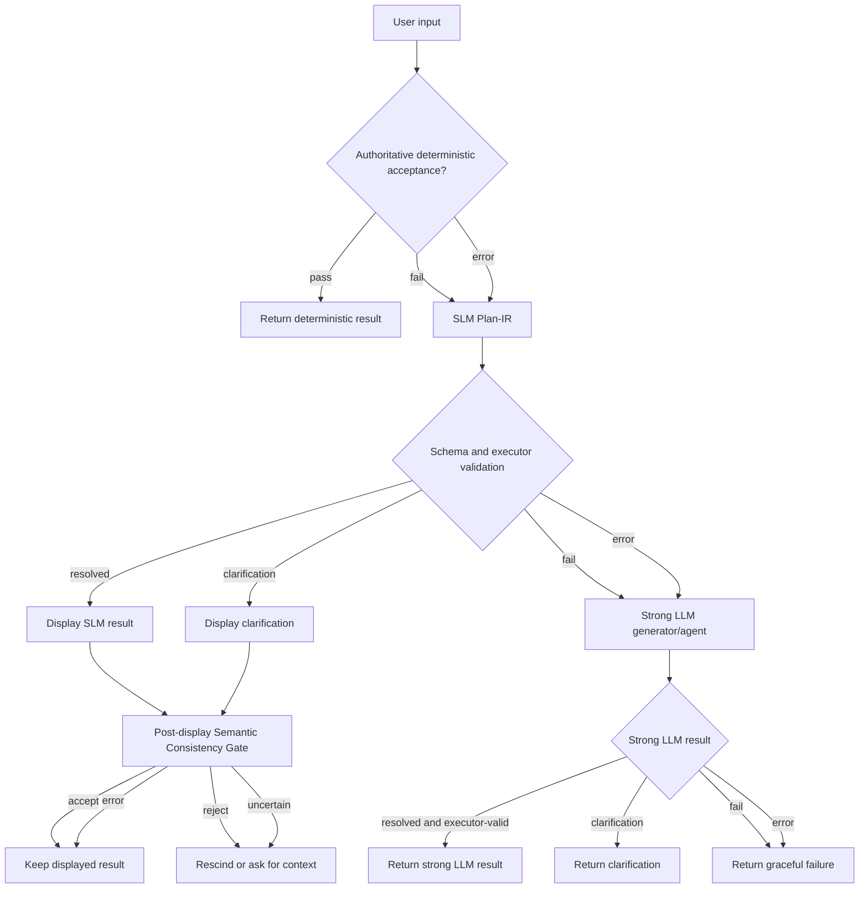

# Temporal Parser Cascade Architecture

This document captures the target parser shape for the desktop app and eventual API. The goal is not to maximize architecture; the goal is to measure and choose the cheapest flow that preserves accuracy and latency targets.

## Product Goals

- Accuracy: wrong singular timestamp answers are worse than clarification, no-plan, or fallback.
- Latency: user-visible temporal parsing should usually return within the 5 second product SLO.
- Cost: hosted temporal model spend remains capped unless explicitly approved.
- Privacy: raw user text retention is separate from product analytics and requires an explicit policy.
- Maintainability: do not grow deterministic natural-language heuristics to patch individual SLM misses.

## Deterministic Acceptance Boundary

Deterministic code has two lanes, but only one is allowed to directly accept a parse.

### Authoritative Deterministic Acceptance

This lane is intentionally narrow. It can return immediately only when the input is a complete, explicit syntax with no fuzzy interpretation and no current-time reasoning beyond converting an absolute instant to the requested timezone.

Allowed examples:

- A Discord timestamp tag such as `<t:1779724800:F>`, with harmless surrounding whitespace.
- A supported bare Unix epoch length, with harmless surrounding whitespace.
- An explicit ISO instant with `Z` or a numeric offset, such as `2026-05-25T12:00:00Z`.

Acceptance requirements:

- The recognized token covers the whole meaningful input after trimming harmless padding.
- No natural-language temporal words are being interpreted.
- No date/time defaults are invented.
- No ambiguous abbreviation, fuzzy clock, typo, shorthand, relative phrase, or event-post extraction is involved.

### Deterministic Evidence

Deterministic tools may still produce useful facts, candidates, validation results, formatted output, and timezone/calendar math for other stages. Those outputs are evidence, not direct acceptance, when the original input requires fuzzy interpretation.

Examples that should not be direct deterministic acceptance by default:

- `12pm`
- `tomorrow`
- `next friday at 5`
- `may 29 7`
- pasted event prose
- chrono partial parses with unconsumed trailing text

These should go through the SLM Plan-IR path or strong LLM path, then deterministic execution/validation after the semantic interpretation is chosen.

## Semantic Consistency Gate

Use exactly this name in docs and code: `Semantic Consistency Gate`.

The Semantic Consistency Gate is a one-shot small LLM check by default. It is not a generator and must not repair or produce a new timestamp. It evaluates whether the solver output is semantically consistent with the original input and supplied deterministic facts.

Product UX should prefer async/post-display verification: show the resolved SLM result immediately, keep a pulsing `Verifying` affordance, then accept, rescind, or ask for more context after the gate returns. The gate must validate the exact displayed candidate, not rerun parsing or generate a replacement timestamp. Blocking gate mode remains useful for evals and diagnostics, but should not define first-display latency.

Inputs should include:

- original user text
- reference instant
- request timezone
- solver stage and model identity
- Plan-IR or deterministic evidence used
- candidate or clarification alternatives
- rendered candidate formats
- candidate facts such as weekday, clock, date, and timezone
- deterministic schema/executor validation
- prior attempt failure reasons when present

Outputs:

- `accept`
- `reject`
- `uncertain`
- reason codes
- concise explanation

Clarification outputs should also pass through this gate when the gate is enabled. The question is the same: are these clarification alternatives reasonable given the user input and supplied facts?

Current product conventions the gate must respect when deterministic evidence supports them:

- Unqualified `first of the month` is future-looking and resolves to the next first-of-month when the current month's first at local noon is not in the future.
- Date-like relative offsets using days, weeks, months, or years with no explicit clock use date precision at 12:00 PM local time; hour/minute offsets preserve exact time arithmetic.
- A bare integer `13` through `23` as the whole meaningful input is supported 24-hour clock shorthand and resolves to the next occurrence of that local hour. Bare `1` through `12` remains meridiem-ambiguous unless another signal resolves it.
- Bare numeric `0` is supported explicit Unix epoch zero when deterministic evidence shows epoch parsing.
- Stable leet/l33t/133t/1337 time phrases are supported cultural clock phrases mapping to `13:37` when Plan-IR uses `interpret_clock_phrase`.

## Default Cascade

The strong LLM generator/agent should receive a prior-attempt packet: deterministic stage outcome, SLM Plan-IR output or parse error, executor validation, and Semantic Consistency Gate result. This lets the strong model correct or clarify without rediscovering every fact from scratch.

## Stage Outcomes

Every stage should report one of these stage outcomes:

- `pass`: stage accepted its own responsibility.
- `fail`: stage completed and determined its output should not be accepted.
- `uncertain`: stage completed but cannot safely decide.
- `error`: infrastructure, timeout, parse error, provider error, or other non-semantic failure.

Every parser result should separately report result status:

- `resolved`
- `needs_clarification`
- `failed`

This avoids confusing a stage pass with a resolved timestamp. A clarification can be a successful stage output.

## One-Shot Versus Agentic Validation

Default to one-shot Semantic Consistency Gate calls.

Agentic validation is only justified if the verifier needs facts that were not included in the packet. The preferred fix is to add those deterministic facts to the packet, not to give the verifier tools by default.

Escalation to the strong LLM generator/agent is the repair path. The Semantic Consistency Gate should remain a veto/check stage.

## API Position

The default API behavior should be this cascade. Do not add multiple public modes until measurements show that a user-facing control changes meaningful tradeoffs.

Possible future API quality levels can mirror reasoning levels, but they should be introduced after we can report cost, accuracy, and latency deltas from the generation ledger.

## Structurizr Position

Structurizr is useful for the C4/container view of the eventual product and API, especially because it is model-as-code and supports dynamic diagrams. For the immediate parser decision flow, Mermaid is sufficient and easier to keep close to the implementation notes.

If the temporal API becomes a separate service, add a Structurizr DSL workspace for system context, container, deployment, and dynamic views. Keep this Mermaid cascade as the stage contract.
